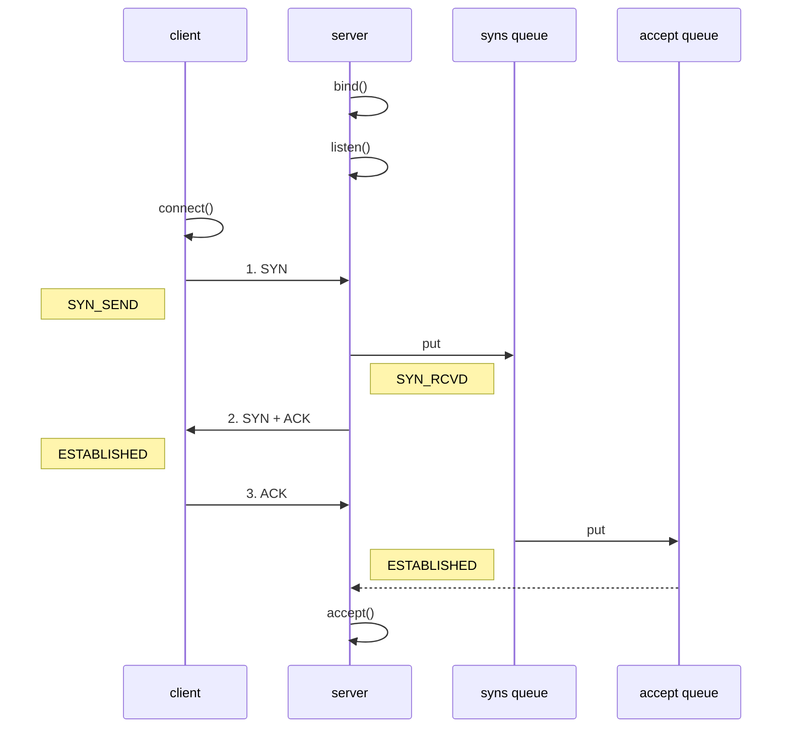

## Channel事件

- connect: 客户端连接成功时触发
- accept: 服务器端成功接受连接时触发
- read: 数据可读入时触发，有因为接收能力弱，数据暂不能读入的情况
- write: 数据可写出时触发，有因为发送能力弱，数据暂不能写出的情况

## EventLoop

> EventLoop 本质是一个单线程执行器（同时维护了一个 Selector），里面有 run 方法处理 Channel 上源源不断的 io 事件。

### 分工细化

- group中指定Boos与worker. Boss处理ServerSocketChannel的accept.(
  ServerSocketChannel只和一个eventLoop绑定,因此可以不需要指定线程数)
  Worker: 负责SocketChannel 的读写
- Netty中不要阻塞IO线程, 将处理业务的worker线程分工细化,由外部线程处理业务.

## Channel

### ChannelFeature

> `connect`方法是一个异步方法,真正执行连接的线程是nio线程,因此主线程直接获取channel,channel并未真正建立连接

- 使用Future.sync()来阻塞主线程直到连接成功建立
- 使用Feature.addListener()来指定一个回调对象,通过其他线程来调用回调.主线程只负责传递回调

### CloseFeature

> channel.close()方法也是一个异步方法,直接在close()方法下调用关闭逻辑是错误的.
> 可以获取到closeFuture()后,使用sync()或者addListener()来处理关闭逻辑.
> 最后可以获取到EventLoopGroup对象,调用`group.shutdownGracefully()`来关闭eventLoop线程.

## Future & Promise

> 在异步处理时，经常用到这两个接口

> 首先要说明 netty 中的 Future 与 jdk 中的 Future 同名，但是是两个接口，netty 的 Future 继承自 jdk 的 Future，而 Promise 又对
> netty Future 进行了扩展

* jdk Future 只能同步等待任务结束（或成功、或失败）才能得到结果
* netty Future 可以同步等待任务结束得到结果，也可以异步方式得到结果，但都是要等任务结束
* netty Promise 不仅有 netty Future 的功能，而且脱离了任务独立存在，只作为两个线程间传递结果的容器

| 功能/名称        | jdk Future      | netty Future                          | Promise |
|--------------|-----------------|---------------------------------------|---------|
| cancel       | 取消任务            | -                                     | -       |
| isCanceled   | 任务是否取消          | -                                     | -       |
| isDone       | 任务是否完成，不能区分成功失败 | -                                     | -       |
| get          | 获取任务结果，阻塞等待     | -                                     | -       |
| getNow       | -               | 获取任务结果，非阻塞，还未产生结果时返回 null             | -       |
| await        | -               | 等待任务结束，如果任务失败，不会抛异常，而是通过 isSuccess 判断 | -       |
| sync         | -               | 等待任务结束，如果任务失败，抛出异常                    | -       |
| isSuccess    | -               | 判断任务是否成功                              | -       |
| cause        | -               | 获取失败信息，非阻塞，如果没有失败，返回null              | -       |
| addLinstener | -               | 添加回调，异步接收结果                           | -       |
| setSuccess   | -               | -                                     | 设置成功结果  |
| setFailure   | -               | -                                     | 设置失败结果  |

## Handler & Pipeline

> ChannelHandler 用来处理 Channel 上的各种事件，分为入站、出站两种。所有 ChannelHandler 被连成一串，就是 Pipeline

* 入站处理器通常是 ChannelInboundHandlerAdapter 的子类，主要用来读取客户端数据，写回结果
* 出站处理器通常是 ChannelOutboundHandlerAdapter 的子类，主要对写回结果进行加工

> 打个比喻，每个 Channel 是一个产品的加工车间，Pipeline 是车间中的流水线，ChannelHandler 就是流水线上的各道工序，而后面要讲的
> ByteBuf 是原材料，经过很多工序的加工：先经过一道道入站工序，再经过一道道出站工序最终变成产品

### ctx.channel().write(msg) vs ctx.write(msg)

* 都是触发出站处理器的执行
* ctx.channel().write(msg) 从尾部开始查找出站处理器
* ctx.write(msg) 是从当前节点找上一个出站处理器

### EmbeddedHandler

> 用于调试inbound 与 outbound handler的工具类,避免创建服务器与客户端.

## ByteBuf

#### 直接内存 vs 堆内存

可以使用下面的代码来创建池化基于堆的 ByteBuf

```
ByteBuf buffer = ByteBufAllocator.DEFAULT.heapBuffer(10);
```

也可以使用下面的代码来创建池化基于直接内存的 ByteBuf

```
ByteBuf buffer = ByteBufAllocator.DEFAULT.directBuffer(10);
```

* 直接内存创建和销毁的代价昂贵，但读写性能高（少一次内存复制），适合配合池化功能一起用
* 直接内存对 GC 压力小，因为这部分内存不受 JVM 垃圾回收的管理，但也要注意及时主动释放

### 池化 vs 非池化

池化的最大意义在于可以重用 ByteBuf，优点有

* 没有池化，则每次都得创建新的 ByteBuf 实例，这个操作对直接内存代价昂贵，就算是堆内存，也会增加 GC 压力
* 有了池化，则可以重用池中 ByteBuf 实例，并且采用了与 jemalloc 类似的内存分配算法提升分配效率
* 高并发时，池化功能更节约内存，减少内存溢出的可能

池化功能是否开启，可以通过下面的系统环境变量来设置

```
-Dio.netty.allocator.type={unpooled|pooled}
```

### ByteBuf 优点

- 池化 - 可以重用池中 ByteBuf 实例，更节约内存，减少内存溢出的可能
- 读写指针分离，不需要像 ByteBuffer 一样切换读写模式
- 可以自动扩容
- 支持链式调用，使用更流畅
- 很多地方体现零拷贝，例如 slice、duplicate、CompositeByteBuf

## 黏包半包

### 粘包

现象，发送 abc def，接收 abcdef
原因
应用层：接收方 ByteBuf 设置太大（Netty 默认 1024）
滑动窗口：假设发送方 256 bytes 表示一个完整报文，但由于接收方处理不及时且窗口大小足够大，这 256 bytes
字节就会缓冲在接收方的滑动窗口中，当滑动窗口中缓冲了多个报文就会粘包
Nagle 算法：会造成粘包

### 半包

现象，发送 abcdef，接收 abc def
原因
应用层：接收方 ByteBuf 小于实际发送数据量
滑动窗口：假设接收方的窗口只剩了 128 bytes，发送方的报文大小是 256 bytes，这时放不下了，只能先发送前 128 bytes，等待 ack
后才能发送剩余部分，这就造成了半包
MSS 限制：当发送的数据超过 MSS 限制后，会将数据切分发送，就会造成半包

### 解决方案

- 短链接，发一个包建立一次连接，这样连接建立到连接断开之间就是消息的边界，缺点效率太低
- 每一条消息采用固定长度，缺点浪费空间
- 每一条消息采用分隔符，例如 \n，缺点需要转义
- 每一条消息分为 head 和 body，head 中包含 body 的长度

## 空闲检测与心跳

```
    /**
     * Creates a new instance firing {@link IdleStateEvent}s.
     *
     * @param readerIdleTimeSeconds
     *        an {@link IdleStateEvent} whose state is {@link IdleState#READER_IDLE}
     *        will be triggered when no read was performed for the specified
     *        period of time.  Specify {@code 0} to disable.
     * @param writerIdleTimeSeconds
     *        an {@link IdleStateEvent} whose state is {@link IdleState#WRITER_IDLE}
     *        will be triggered when no write was performed for the specified
     *        period of time.  Specify {@code 0} to disable.
     * @param allIdleTimeSeconds
     *        an {@link IdleStateEvent} whose state is {@link IdleState#ALL_IDLE}
     *        will be triggered when neither read nor write was performed for
     *        the specified period of time.  Specify {@code 0} to disable.
     */
    public IdleStateHandler(
            int readerIdleTimeSeconds,
            int writerIdleTimeSeconds,
            int allIdleTimeSeconds) {
    }
    
    
    //....
    // 服务端增加读空闲检测, 
    // 客户端增加写空闲检测,触发发送*心跳包*事件
    
```

## netty优化

### 参数调优

#### CONNECT_TIMEOUT_MILLIS

> 属于 SocketChannel 参数
> 用在客户端建立连接时，如果在指定毫秒内无法连接，会抛出 timeout 异常
> SO_TIMEOUT 主要用在阻塞 IO，阻塞 IO 中 accept，read 等都是无限等待的，如果不希望永远阻塞，使用它调整超时时间

#### SO_BACKLOG

> 属于 ServerSocketChannel 参数



1. 第一次握手，client 发送 SYN 到 server，状态修改为 SYN_SEND，server 收到，状态改变为 SYN_REVD，并将该请求放入 sync queue 队列
2. 第二次握手，server 回复 SYN + ACK 给 client，client 收到，状态改变为 ESTABLISHED，并发送 ACK 给 server
3. 第三次握手，server 收到 ACK，状态改变为 ESTABLISHED，将该请求从 sync queue 放入 accept queue

其中

* 在 linux 2.2 之前，backlog 大小包括了两个队列的大小，在 2.2 之后，分别用下面两个参数来控制

* sync queue - 半连接队列
    * 大小通过 /proc/sys/net/ipv4/tcp_max_syn_backlog 指定，在 `syncookies` 启用的情况下，逻辑上没有最大值限制，这个设置便被忽略
* accept queue - 全连接队列
    * 其大小通过 /proc/sys/net/core/somaxconn 指定，在使用 listen 函数时，内核会根据传入的 backlog 参数与系统参数，取二者的较小值
    * 如果 accpet queue 队列满了，server 将发送一个拒绝连接的错误信息到 client

netty 中

可以通过 option(ChannelOption.SO_BACKLOG, 值) 来设置大小

## 调试

> 首先Find usage.
> 点击变量名,IDEA右侧红色条框代表变量赋值位置.